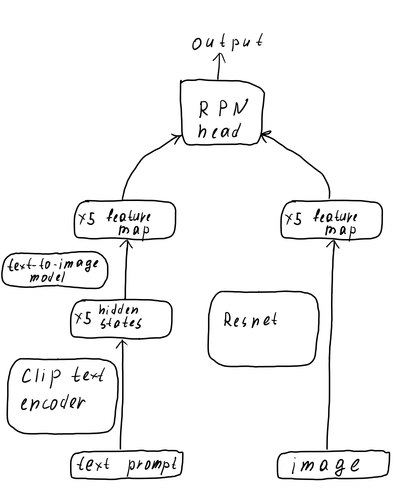
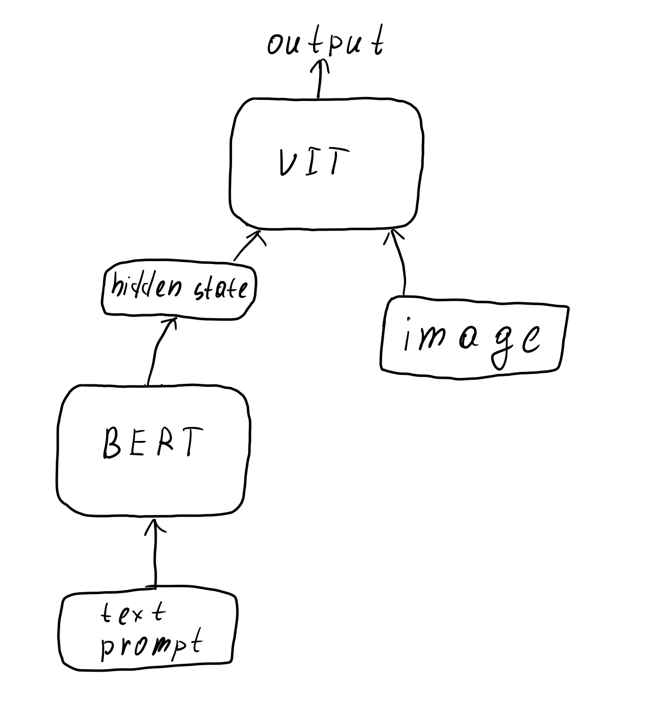

# Object Detection via Text Prompts: AIMasters NLP Course Project

**Dataset:** [OmniLabel Dataset](https://www.omnilabel.org/about)

## Developed Models

### 1. CLIPResNetCrossCorrGen
- **Description:** Combines CLIP's text encoder with ResNet as the image encoder, integrating a text-to-image model for text encoding.
- **Performance:** Achieved an evaluation mAP of 0.61.

**Key References:**
- [Learning Transferable Visual Models From Natural Language Supervision](https://arxiv.org/abs/2103.00020)
- [Generative Adversarial Text to Image Synthesis](https://arxiv.org/abs/1605.05396)
- [High Performance Visual Tracking with Siamese Region Proposal Network](https://openaccess.thecvf.com/content_cvpr_2018/papers/Li_High_Performance_Visual_CVPR_2018_paper.pdf)
- [Deep Residual Learning for Image Recognition](https://arxiv.org/abs/1512.03385)
- [SSD: Single Shot MultiBox Detector](https://arxiv.org/abs/1512.02325)

### 2. BertVIT
- **Description:** Utilizes DistilBERT as the text encoder and a Vision Transformer (ViT) for text-image fusion.
- **Performance:** Achieved an evaluation mAP of 0.74.

**Key References:**
- [BERT: Pre-training of Deep Bidirectional Transformers for Language Understanding](https://arxiv.org/abs/1810.04805)
- [An Image is Worth 16x16 Words: Transformers for Image Recognition at Scale](https://arxiv.org/abs/2010.11929)
- [SSD: Single Shot MultiBox Detector](https://arxiv.org/abs/1512.02325)

## Future Work
1. Optimize anchor sizes for better detection performance.
2. Use CLS token embeddings instead of mean pooling for CLIPResNetCrossCorrGen.
3. Pre-train the models on additional datasets to enhance generalization.